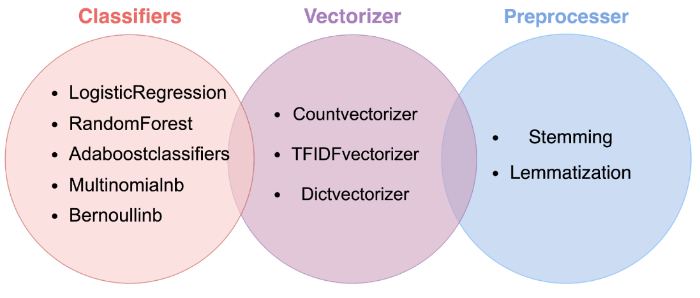

# DSI-Project-3-Web-APIs-Classification : Depression Diagnosis based on Natural Language Processing 

Teammate project : billythanapong (https://github.com/billythanapong)

### Contents:
- [Problem Statement](#Problem-Statement)
- [Executive Summary](#Executive-Summary)
- [Conclusions and Recommendations](#Conclusions-and-Recommendations)
- [Further Improvements](#Further-Improvements) 

### Problem Statement 

Depression (major depressive disorder) is a common and serious medical illness that negatively affects how you feel, the way you think and how you act. Fortunately, it is also treatable. Depression causes feelings of sadness and/or a loss of interest in activities you once enjoyed. It can lead to a variety of emotional and physical problems and can decrease your ability to function at work and at home. 

Felix Torres, a physician, reviewed that depression affects an estimated one in six people (16.6%) will experience depression at some time in their life, especially during the late teens to mid-20s.
[Source](https://psychiatry.org/patients-families/depression/what-is-depression) Therefore, people tend to seek a safe space to express their depression.

Reddit is a social news site where users create and share content. The site has communities called subreddits for different interests and any user can create a subreddit.
As users browse, they can choose to go to specific communities. Their front page features posts from all the communities they follow. They can also browse r/all, which draws popular posts from subreddits all over Reddit.

The users in these subreddits tend to be very supportive of those in their community. Because each subreddit has rules users need to abide by as well, moderators will ban or suspend anyone who tries to put others down. As a result, many of these support communities serve as safe spaces for those most vulnerable.[Source](https://www.internetmatters.org/hub/news-blogs/what-is-reddit-what-parents-need-to-know/)

However, expressing the depression of some people is not enough. The depression can develop into anxiety, self-harm, suicide, and creating violence in the society.

This leads our to the problem: **"How can we differentiate between depressed and normal people who want to get off their chest?"**

### Executive Summary

The objective of this project is to classify from 2 different subreddits begins by looping requests to pull data using Reddit's API from /r/depression (peer support for anyone struggling with a depressive disorder including 908,197 subscribers) and /r/offmychest (a mutually supportive community including 2,918,050 subscribers), clean the collected data by excluding the irrelevant content, rearrange the complex data into simple form in order to proceed in the next step. We focus on the title and selftext of the posts and subreddit in order to conduct natural language processing. 

In the data cleaning process, we get rid of duplicate posts. Due to the presence of empty data in selftext column, we convert title and selftext columns into text column. Check NaN values with empty string for 'text', else the operation cannot be done, exclude the irrelevent word, i.e. amp., clean data like removing stopwords, non-letters, etc.) At last, the final remaining data has 1863 rows, which consist of 975 rows of depression and 888 rows of offmychest.

Then, EDA is performed to analyze the length of word, people who have depression use the shorter length comparing to vent people as they don't express much about their stress and tend to keep it to themselves. While vent people, they like to express their concern by complaing and explaining until they feel better. For the average wording sentiment score, the wording of depressed people can give a larger negative sentiment score comparing to vent people. At last, the analysis of 1,2,3-word frequency showed that word 'anymore, depression, suicidal thoughts and want die' were related to depressed people. While, people who just want to vent their concerns tend to use word 'long time, best friend, and high school'.

The obtained data was used to create benchmark model by convecteize words, use logistic regression, and remove impact words, i.e. 'depression' and 'depressed', According to the coefficient of the obtained benchmarking, the words that highly correlated to depressed people were 'thoughts, alive, felt, therapy, mouths, granny, living, and girlfriend taking' and people who need to vent their feelings were related to 'sex, happened, decided, gets, child, free car, and scared'.

The training accuracy and testing accuracy score of benchmarking model were equal to 100% and 71%, respectively, which are higher than baseline score of depression (52.33%) and vent (47.67%). The evaluation was based on recall scores to reduce the risk of false negative. The false negative in this study represents the false prediction of the model that classify people as normal people who only need to get off their chest eventhough they are actually having a depression.

In this process we have walkthrough this step as shown in the figure.

Finally, we select the model pipeline of TFIDFvectorizer and MultinomialNB with the default setting. The difference of training accuracy and testing accuracy score from this model is 6.35 %, which is slightly overfitted. However, the objective of this project is to help depression people as much as we can that can reduce type II error the most. This model can reduce type II error (people who are depressed but not get predicted as depressed) which we focus the most down to 35 out of 244 people, who are depressed. Furthermore, Stemming could help with the accuracy score and reduce type II error from 33 to 35. So we decided to use the best model Multinomial Naive Bayes with TFIDfVectorizer Model and 
Stemming process for the hyperparameter Tuning. Finally we can reduce the difference of training accuracy and testing accuracy score from this model is 5.14 % and have type II error 35 people.

The last model that we have selected performed well (Accuracy > 75%) and exceed the baseline accuracy (52.33%. Also, this model has been tested on new dataset of depression people from twitter and we got an impressive result of 49% accuracy. [Source](https://www.kaggle.com/datasets/kazanova/sentiment140)
 

### Conclusions and Recommendations

This model could be used for effectively detecting depressed individuals on social media. Therefore, this study exhibits the model that can help reddit to detect depressed people who need emotional support and someone to help solving their problems. In Social Media posts which contain the words : thoughts, alive, felt, therapy should be flagged as cause for concern and notify the family so they can offer care and support.

However, the model can be improved by collecting more related data, including other platforms, and selecting the better classification model to increase the accuracy of prediction. 
